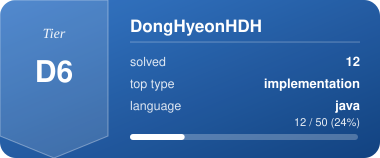

<!--
### Hi there 👋
-->
<!--
**DongHyeonHDH/DongHyeonHDH** is a ✨ _special_ ✨ repository because its `README.md` (this file) appears on your GitHub profile.

Here are some ideas to get you started:

- 🔭 I’m currently working on ...
- 🌱 I’m currently learning ...
- 👯 I’m looking to collaborate on ...
- 🤔 I’m looking for help with ...
- 💬 Ask me about ...
- 📫 How to reach me: ...
- 😄 Pronouns: ...
- ⚡ Fun fact: ...
-->

  

####  :wave: Welcome my github profile !
   
   
📋: possible skills 

   

    
    
 
####  📝: My study log with git
   
  

   

<!-- ALGO-STATS:START -->

### 🧩 Algorithm Problem Solving

| 티어 | 문제 수 |
|---|---|
| D2 | 1 |
| D3 | 1 |
| D4 | 7 |
| D6 | 1 |

**사용 언어**: `java` 12

**자주 푼 유형 TOP 6**: `implementation` (10), `bfs` (3), `dfs` (3), `graph` (2), `union-find` (2), `dynamic-programming` (1)

최근 푼 문제 (8)

| 날짜 | 문제 | 플랫폼 | 티어 | 유형 |
|---|---|---|---|---|
| 2026-09-22 | [[5215] 햄버거 다이어트](https://app.notion.com/p/5215-3e385b4179ee81abb614ea7cb6ffa106) | SWEA | D3 | dynamic-programming, implementation |
| 2026-09-21 | [[1868] 파핑파핑 지뢰찾기](https://app.notion.com/p/1868-3e285b4179ee811a9fdef6720f290976) | SWEA | D4 | bfs, implementation |
| 2026-09-18 | [[8382] 방향 전환](https://app.notion.com/p/8382-3df85b4179ee811bacfbeaa0acf64d6b) | SWEA | D4 | graph, bfs |
| 2026-09-17 | [[7465] 창용 마을 무리의 개수](https://app.notion.com/p/7465-3de85b4179ee81048229e325dddf3073) | SWEA | D4 | union-find, implementation |
| 2026-09-17 | [[3289] 서로소 집합](https://app.notion.com/p/3289-3de85b4179ee810b9bdee8b6489a1571) | SWEA | D4 | union-find, implementation |
| 2026-09-17 | [[4613] 러시아 국기 같은 깃발](https://app.notion.com/p/4613-3de85b4179ee81fcad1bee9f7d17b6e2) | SWEA | D4 | implementation |
| 2026-09-16 | [[7699] 수지의 수지 맞는 여행](https://app.notion.com/p/7699-3dd85b4179ee813e8de1f22dd7e2cb9a) | SWEA | D4 | dfs, bfs, implementation |
| 2026-09-16 | [[1267] [S/W 문제해결 응용] 10일차 - 작업순서](https://app.notion.com/p/1267-S-W-10-3dd85b4179ee81ee89f5e574731e5c8d) | SWEA | D6 | graph, implementation |

_Last synced: 2026-09-22 23:23 UTC · from [Algorithm Note](https://notion.so) via GitHub Actions_

<!-- ALGO-STATS:END -->

